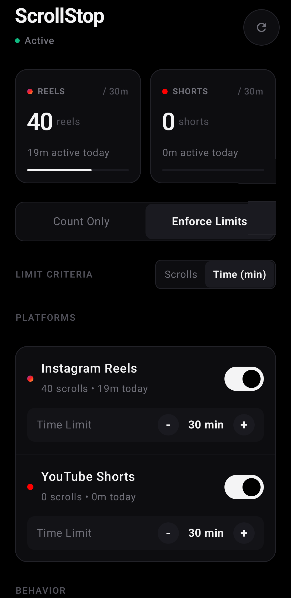
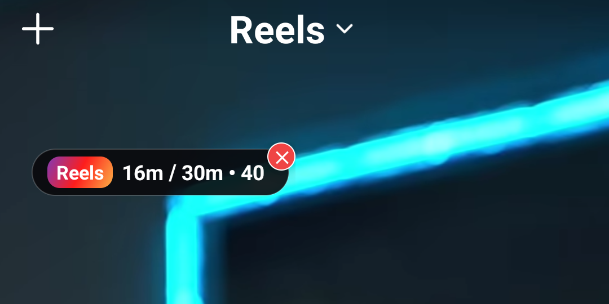
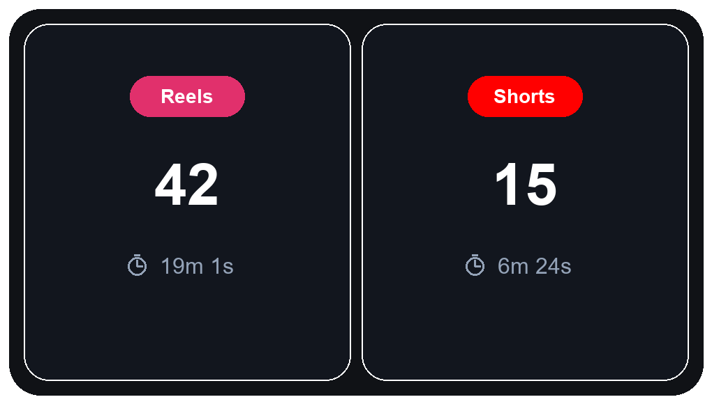

# ScrollStop 📱🧘

[-22c55e?style=for-the-badge&logo=android&logoColor=white)](https://github.com/PDineshMurugan/ScrollStop/raw/main/release/scrollstop.apk)
[-3DDC84?style=for-the-badge&logo=android&logoColor=white)](https://developer.android.com)
[](https://kotlinlang.org)
[](https://developer.android.com/jetpack/compose)
[](#-privacy--security-manifesto)
[](LICENSE)

**ScrollStop** is a featherlight (~1 MB), distraction-free native Android utility designed to curb mindless doomscrolling on **Instagram Reels** and **YouTube Shorts**. Built with modern Jetpack Compose, true pitch-black OLED aesthetics, and intelligent debounced accessibility detection, it provides real-time awareness and mindful friction without draining battery or compromising privacy.

---

## 📥 Direct Download APK (No Compilation Needed)

| Artifact | Direct Link | File Size | Description |
| :--- | :--- | :--- | :--- |
| **Direct APK Download** | [⬇️ **Download `scrollstop.apk`**](https://github.com/PDineshMurugan/ScrollStop/raw/main/release/scrollstop.apk) | ~1.0 MB | Instant 1-tap direct install from repo |
| **Versioned Release APK** | [📦 **Download `scrollstop-v1.0.0.apk`**](https://github.com/PDineshMurugan/ScrollStop/raw/main/release/scrollstop-v1.0.0.apk) | ~1.0 MB | Direct install of v1.0.0 production build |
| **Local Cloned Path** | [`release/scrollstop.apk`](release/scrollstop.apk) | ~1.0 MB | Local file if you cloned this repository |
| **GitHub Releases Hub** | [🏷️ **GitHub Releases Archive**](https://github.com/PDineshMurugan/ScrollStop/releases) | — | Release tags, changelogs & release assets |

> **Installation Quick-Start**:
> 1. Download the APK file directly to your phone using the button above.
> 2. Tap the downloaded file in your browser or Files app.
> 3. If prompted by Android, tap **"Settings"** ➔ **"Allow from this source"** ➔ **"Install"**.

---

## 📸 Screenshots

| Minimalist Dashboard | Real-Time Floating HUD | Home Screen Widget |
| :---: | :---: | :---: |
|  |  |  |
| *Clean glance metrics, OLED black palette, & instant mode switching* | *Frosted HUD, tap-to-close badge, & real-time time & scroll tracking* | *Pitch-black home widget showing today's scrolls & active duration* |

---

## ✨ Features

- **🖤 OLED Minimalist Design (Zero Bloat)**: Pure pitch-black (`#000000`) theme engineered for 0% battery drain on OLED screens. Inspired by Nothing OS and high-end utility design—quiet typography, low visual weight, and zero emoji clutter.
- **🎯 Intelligent Reel & Short Detection**:
  - Differentiates vertical short-form reels from standard posts, feed carousels, stories, comments sheets, and regular YouTube videos.
  - Signature-based transition debouncing prevents repeated count bumps on re-scrolls or audio/author changes.
- **🪟 Discreet Floating HUD**:
  - Automatically appears **only** inside active Reels or Shorts; instantly hides when returning to standard feeds or other apps.
  - Featherweight frosted-black glass styling with hairline border.
  - **Quick Exit Badge**: Single-tap reveals a discreet top-right `✕` badge to immediately close the short-form platform and return to home screen.
- **📊 Real-Time Home Screen Widget**:
  - Live glanceable tracking of today's scroll count and time spent for Instagram Reels and YouTube Shorts right on your launcher.
- **⚡ Dual Operating Modes**:
  - **Counter Only**: Pure awareness mode with zero interruptions.
  - **Enforce Limits**: Automatically locks or redirects to the home screen with an optional mindful break dialog when daily scroll or time limits are reached.
- **🔄 Midnight Auto-Reset**: Automatically rolls over counters at 00:00 every day without background alarms or scheduled wakeups.
- **🚀 Integrated Auto-Update & Versioning**:
  - Checks GitHub Releases in the background on startup or via one-tap manual check.
  - Direct 1-tap in-app APK download and prompt whenever a new release is available.
- **💬 In-App Community & Bug Reporting**:
  - Direct links to GitHub Issues for bug reporting and feature requests built right into the app.

---

## 🔄 Versioning & In-App Auto-Updates

ScrollStop includes native version management and an integrated update pipeline:

1. **Version Tracking**: Clean semantic versioning declared in Gradle (`versionCode = 1`, `versionName = "1.0.0"`) and exposed via `BuildConfig`.
2. **In-App Check for Updates**:
   - The app checks `https://api.github.com/repos/PDineshMurugan/scrollstop/releases/latest` in the background on launch or when tapping **"Check for Updates"** in the app settings.
   - When a new version is published on GitHub, a stylish green banner appears with release notes and a direct **"Download APK"** button.
3. **Automated CI/CD Workflow**:
   - The included GitHub Actions workflow (`.github/workflows/release.yml`) automatically triggers on git tag pushes (e.g. `v1.0.1`).
   - Compiles and minifies with R8, signs the APK, and uploads `scrollstop.apk` and `scrollstop-v{version}.apk` directly to GitHub Releases.

---

## 🔒 Privacy & Security Manifesto

ScrollStop is built on the philosophy of **complete data sovereignty**:

1. **100% Local Event Processing**:
   - All accessibility events, scroll detection, time calculations, and daily counters are processed strictly on your device.
   - **No cloud analytics, no telemetry, no tracking**.
2. **Transparent Network Permission**:
   - The `android.permission.INTERNET` permission is used **exclusively** to check GitHub Releases (`api.github.com`) for app updates and to open GitHub issue forms when initiated by the user. Zero user data is ever transmitted.
3. **Strictly Scoped Accessibility**:
   - Configured with `android:packageNames="com.instagram.android,com.google.android.youtube"`. The Android OS never wakes or reports events from your banking apps, private messaging, browser, passwords, or system settings.
4. **Encrypted System Binding**:
   - The service enforces `android:permission="android.permission.BIND_ACCESSIBILITY_SERVICE"`, ensuring only the Android OS system framework can interact with it.
5. **No Backup Extraction**:
   - `android:allowBackup="false"` is set to prevent unauthorized local ADB backup extraction.

---

## 🏗️ System Architecture

```text
                                YOUR ANDROID DEVICE
                                         │
                 ┌───────────────────────┴───────────────────────┐
                 ▼                                               ▼
         [ Instagram App ]                               [ YouTube App ]
       com.instagram.android                        com.google.android.youtube
                 │                                               │
                 └───────────────────────┬───────────────────────┘
                                         │
                            Android Accessibility Events
                         (Strictly Scoped to Target Packages)
                                         │
                                         ▼
                          [ ScrollAccessibilityService ]
                                         │
                   ┌─────────────────────┼─────────────────────┐
                   ▼                     ▼                     ▼
            [ AppDetector ]    [ PreferencesManager ]   [ OverlayManager ]
         • Isolates Reels/Shorts • Local DataStore/Prefs  • Frosted HUD Tag
         • Debounces signatures • Midnight Auto-Reset   • Quick Exit Badge
         • Filters comments/feed • Dispatches Widget Sync • Mindful Break Screen
                                         │
                   ┌─────────────────────┼─────────────────────┐
                   ▼                                           ▼
            [ UpdateManager ]                        [ ScrollCounterWidget ]
       • Checks GitHub Releases                     Real-time Home Screen Widget
       • Auto-detects updates
```

---

## ⚙️ Initial Device Setup

1. **Install and Launch ScrollStop**: Open the app from your launcher.
2. **Enable Accessibility Service**:
   - Navigate to `Settings` ➔ `Accessibility` ➔ `Installed apps` ➔ `ScrollStop Service` ➔ **Turn ON**.
   - *(Note: If Android displays "Restricted setting", go to `App Info` ➔ tap the top-right three dots `⋮` ➔ select `Allow restricted settings`).*
3. **Enable Display Over Other Apps**:
   - Grant overlay permission to allow the discreet floating pill to render while scrolling Reels/Shorts.
4. **Add the Home Screen Widget**:
   - Long-press your home screen ➔ tap `Widgets` ➔ select `ScrollStop` ➔ drag onto your home screen.

---

## 💬 Bug Reports & Feature Requests

Encountered an issue, false scroll count, or have an idea for a new feature? You can open tickets directly from inside the app under the **Community & Updates** section, or use the links below:

- 🐛 **Report a Bug**: [Open Bug Report](https://github.com/PDineshMurugan/ScrollStop/issues/new?template=bug_report.md&title=%5BBug%5D+)
- 💡 **Request a Feature**: [Open Feature Request](https://github.com/PDineshMurugan/ScrollStop/issues/new?template=feature_request.md&title=%5BFeature%5D+)
- 🏷️ **GitHub Issues**: [Browse All Issues](https://github.com/PDineshMurugan/ScrollStop/issues)
- ⭐ **GitHub Repository**: [PDineshMurugan/ScrollStop](https://github.com/PDineshMurugan/ScrollStop)

---

## 🛠️ Tech Stack

- **Target SDK**: `35` (Android 15 Ready)
- **Minimum SDK**: `26` (Android 8.0 Oreo+ — covers 96%+ of active Android devices)
- **Toolchain**: Java 17 LTS / Kotlin 2.0+
- **UI Toolkit**: Jetpack Compose with Material 3 (Monochrome Deep Zinc Theme)
- **Compiler Optimizations**: Full R8 code shrinking and ProGuard resource optimization verified (`assembleRelease`).
- **Release Size**: ~1.0 MB

---

## 🚀 Building & Running from Source

### Prerequisites
- Android Studio Ladybug / Meerkat (or newer)
- Android SDK Platform 35
- JDK 17 LTS

### Command Line (Gradle)
```bash
# Debug Build & Direct Install
./gradlew installDebug

# Production Release Build (R8 Minified & Signed)
./gradlew assembleRelease
```
The output APK is generated at:
- `app/build/outputs/apk/release/app-release.apk`
- Ready-to-download copy in `release/scrollstop-v1.0.0.apk`

---

## 📄 License

This project is licensed under the [MIT License](LICENSE) — free and open for personal and commercial use.
